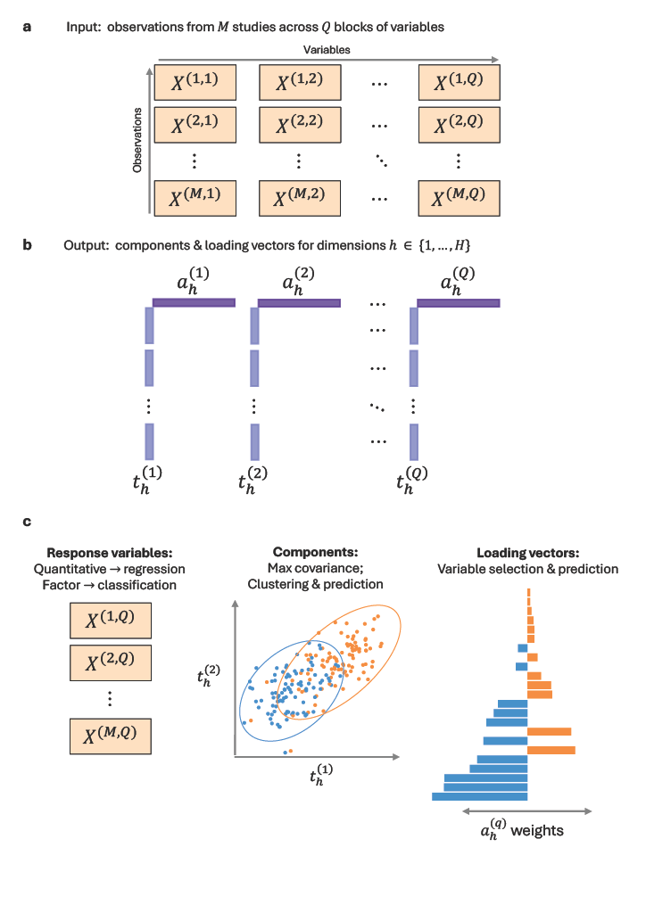

# MINT Block

MINT Block is an NP-integration framework for multi-omics data analysis, that deals with the unwanted variation arising from combining data from multiple studies. MINT Block is implemented in the **mixOmics** R package.

 

Overview of the MINT Block NP-integration framework. **a)** MINT Block performs dimensionality reduction analysis for a dataset consisting of observations from $M$ independent studies across $Q$ blocks of variables. **b)** For each dimension $h \in \{1,...,H\}$ the algorithm computes a (sparse) loading vector $a_h^{(q)}$ and component $t_h^{(q)}$ for each block $q \in \{1,...,Q\}$. After convergence, the input data matrices are deflated and dimension $h + 1$ is computed. **c)** MINT Block performs multivariate regression or classification analysis, depending on the response variables of interest (continuous or categorial factor), and seeks to maximise the covariance of the components across the blocks.

# MINT Block evaluation code repository contents

This repository contains the code we used for evaluating MINT Block, organised in 2 folders.

The [analysis](https://github.com/david-hirst/MINT-Block-evaluation/tree/main/analysis) folder contains files with the R code used to evaluate MINT Block on real multi-omics data. There is a different .rmd file for each dataset we used. Additionally the folder contains an [.rmd file](https://github.com/david-hirst/MINT-Block-evaluation/blob/main/analysis/T2D_DataPrep.Rmd) with the code we used to download and combine a T2D data. 

The [helpers](https://github.com/david-hirst/MINT-Block-evaluation/tree/main/helpers) folder contains functions we created to use in the analyses. Included in the folder are the newly created functions for tuning: 

- [the number of components for a regression model](https://github.com/david-hirst/MINT-Block-evaluation/blob/main/helpers/tune.mint.block.pls.R)
- [the number of components for a classification model](https://github.com/david-hirst/MINT-Block-evaluation/blob/main/helpers/tune.mint.block.plsda.R)
- [the number of variables selected for a regression model](https://github.com/david-hirst/MINT-Block-evaluation/blob/main/helpers/tune.mint.block.spls.R)
- [the number of variables selected for a classification model](https://github.com/david-hirst/MINT-Block-evaluation/blob/main/helpers/tune.mint.block.splsda.R)

